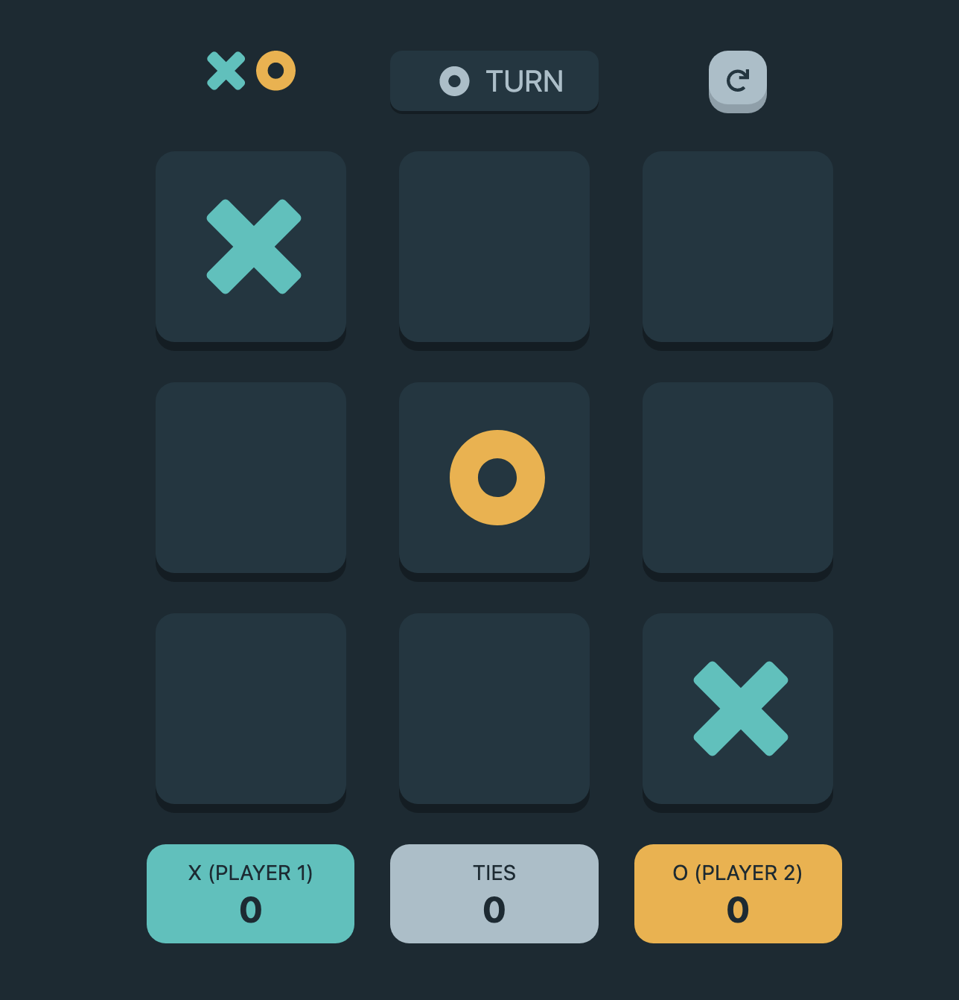

# Frontend Mentor - Tic Tac Toe solution

This is a solution to the [Tic Tac Toe challenge on Frontend Mentor](https://www.frontendmentor.io/challenges/tic-tac-toe-game-Re7ZF_E2v). Frontend Mentor challenges help you improve your coding skills by building realistic projects. 

## Table of contents

- [Overview](#overview)
  - [The challenge](#the-challenge)
  - [Screenshot](#screenshot)
  - [Links](#links)
- [My process](#my-process)
  - [Built with](#built-with)
  - [What I learned](#what-i-learned)
- [Author](#author)

## Overview

### The challenge

Users should be able to:

- ✔️ View the optimal layout for the game depending on their device's screen size
- ✔️ See hover states for all interactive elements on the page
- ✔️ Play the game either solo vs the computer or multiplayer against another person
- ✔️ **Bonus 1**: Save the game state in the browser so that it’s preserved if the player refreshes their browser
- ✔️ **Bonus 2**: Instead of having the computer randomly make their moves, try making it clever so it’s proactive in blocking your moves and trying to win

### Screenshot

### Links

- Solution URL: [URL](https://nathanielfischer.github.io/tic-tac-toe_frontend-mentor-challenge)

## My process

### Built with

- HTML5
- CSS
- Bootstrap
- JavaScript
- jQuery

### What I learned

- Using jQuery and how to manipulate the DOM. 
- Setting and getting Cookies
- Designing a custom toggle switch in detail and making it responsive.
- I learned a little more about SVGs and how they work.

## Author

- Github - [Nathaniel Fischer](https://github.com/nathanielfischer)